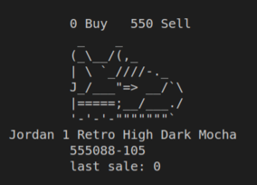
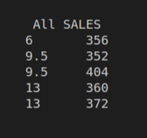
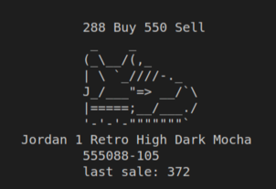

StockX ASCII
============

La aplicacion esta basada en el paradigma POO,ingeniería de software SOLID, utiliza Streams, Interfaces, Jacoco (para la cobertura de pruebas) y esta contruida con Maven.

Como patrón utiliza el Criteria Design.

 ## Salida de la aplicación

Una vez completado el proyecto:

## Historias de usuario /casos de uso

Las historias de usuario están enunciadas en el script principal `Stockx.java`

## Diagrama de clases UML / Arquitectura de la app.

Sigue el diagrama de clase UML proporcionado para construir la aplicación.
Si añades algún componente, dibújalo a mano alzada sobre el diagrama.

